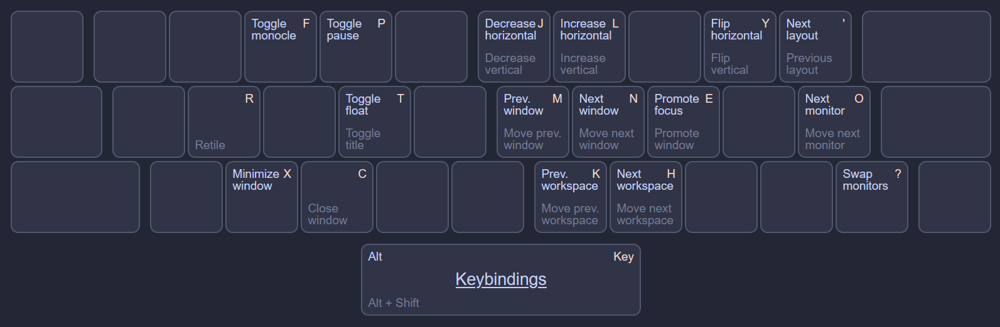

# komorebi-config

This directory contains my personal komorebi config. To use another configuration, replace the files in this directory, specify an alternative config path inside `komotray.ahk`, or start the komorebi server prior to starting komo*Tray*.

## Key bindings

My key bindings are made for Colemak, my keyboard layout of choice. Here's a quick reference chart:



## Install instructions

The following sets up komo*Tray* as a one-stop-shop wrapper around komorebi.

```powershell
# Set installation path
$Env:KOMOTRAY_CONFIG_HOME = "$Env:USERPROFILE\.config\komotray"
$Env:KOMOREBI_CONFIG_HOME = "$Env:KOMOTRAY_CONFIG_HOME\komorebi-config"

# Make KOMOREBI_CONFIG_HOME persistent with user scope
[Environment]::SetEnvironmentVariable('KOMOREBI_CONFIG_HOME', $Env:KOMOREBI_CONFIG_HOME, 'User')

# Clone this repository
git clone https://github.com/urob/komotray $Env:KOMOTRAY_CONFIG_HOME

# Install autohotkey and komorebi
scoop bucket add versions
scoop bucket add extras
scoop install versions/autohotkey1.1 extras/komorebi

# Fetch latest application-specific config tweaks
komorebic fetch-app-specific-configuration

# Enable autostart (not needed if using komoTray to manage komorebi)
#komorebic enable-autostart -c "$Env:KOMOREBI_CONFIG_HOME\komorebi.json"
```
## ... and this is how it looks


