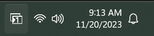

# komo*Tray*

A system tray status indicator for the [komorebi](https://github.com/LGUG2Z/komorebi/) tiling window manager. It shows the focused workspace and monitor and can be used to interact with komorebi.

## Status indicator

> [!NOTE]
> The preview icons below have white foregrounds. To see them, enable darkmode for your browser or Github.

The icon indicates the currently focused monitor using  and  for the left and right monitor. The number at the center of the icon is the currently focused workspace *on the active monitor*.

For example, the first of the following icons indicates that workspace 1 on the left monitor is focused. The second icon indicates that workspace 1 on the right monitor is focused, etc. The last icon indicates that komorebi is currently paused.

    
    
    
    
    

Currently, there are icons included for up to 9 workspaces and for 2 monitors. Setups with more workspaces or more monitors are supported but require adding a suitable collection of icons.

## Usage

To start the tray, simply run the AHK script or the bundled executable. The script detects whether the komorebi server is already running and otherwise starts it.

***Note:*** The first time komo*Tray* is started, the tray icon may eventual disappear in the overflow menu. If this happens simply drag & drop it back to the tray area. After doing this once, Windows should remember the position of komo*Tray* and always show it.

## Tray menu and (optional) hotkeys

A single click on the tray icon will toggle komorebi to pause. A right click opens a menu with additional options to start/restart komorebi or to exit the application. Additional menu options can be configured using the AHK script.

Optionally, komo*Tray* can also be used to configure additional key bindings. See [my personal configuration](komorebi-config) for an example. 

